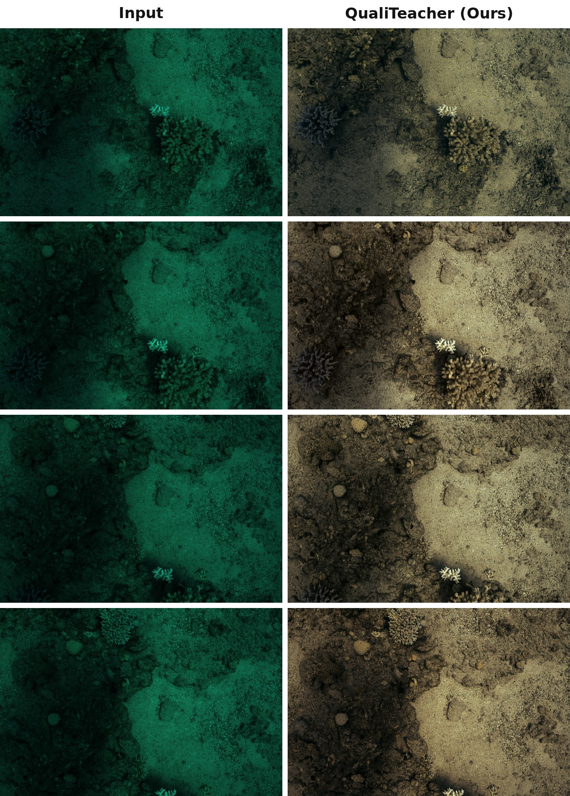

# <p align=center> QualiTeacher </p>

# <p align=center> Quality-Conditioned Pseudo-Labeling for Real-World Image Restoration </p>

<b><p align=center> <a href='https://arxiv.org/abs/2603.08030'></a>
&nbsp; ECCV 2026 </p></b>

This is the official PyTorch implementation of the paper.

> **QualiTeacher: Quality-Conditioned Pseudo-Labeling for Real-World Image Restoration** <br>
> Fengyang Xiao\*, Jingjia Feng\*, Peng Hu, Dingming Zhang, Lei Xu, Guanyi Qin, Lu Li, [Chunming He](https://chunminghe.github.io/)†, and Sina Farsiu <br>
> (\* Equal Contribution, † Corresponding Author)

**Abstract:** Real-world image restoration (RWIR) is highly challenging due to the absence of clean ground-truth images. Many recent methods resort to pseudo-label (PL) supervision within a Mean-Teacher framework, but face a critical paradox: unconditionally trusting imperfect, low-quality PLs forces the student to learn artifacts, while discarding them limits data diversity. QualiTeacher transforms pseudo-label quality from a noisy liability into a **conditional supervisory signal**. Instead of filtering, it explicitly conditions the student on the quality of each PL — estimated by an ensemble of complementary NR-IQA models — teaching the student to learn a **quality-graded restoration manifold**. This allows it to avoid mimicking artifacts and even extrapolate to results of higher quality than the teacher. QualiTeacher serves as a **plug-and-play** strategy that improves existing pseudo-labeling frameworks, establishing a new paradigm for learning from imperfect supervision.

> **This repository releases the Underwater Image Enhancement (UIE) pipeline**, using **Semi-UIR / AIM-Net** as the example backbone. The framework is backbone-agnostic — see [Use QualiTeacher on Your Own Network](#-use-qualiteacher-on-your-own-network).

---

## 🔥 News
- **2026-06-28:** Enhanced **Seathru** results are released — see [Visual Results](#-visual-results). 🖼️
- **2026-06-22:** Code for the underwater pipeline is released. 🎉
- Pretrained weights are available on Google Drive.

## 🔗 Contents
- [Visual Results](#-visual-results)
- [Dependencies and Installation](#️-dependencies-and-installation)
- [Datasets](#-datasets)
- [Pretrained Weights](#-pretrained-weights)
- [Training](#-training)
- [Testing](#-testing)
- [Use QualiTeacher on Your Own Network](#-use-qualiteacher-on-your-own-network)
- [Citation](#-citation)
- [Acknowledgements](#-acknowledgements)

---

## 📷 Visual Results

Qualitative results on the **Seathru** underwater benchmark:

<p align="center">
  
</p>

➡️ **Full-resolution enhanced outputs** for the entire Seathru set (1,020 images) are available on our [**Google Drive**](https://drive.google.com/drive/folders/1KIhfwTAfrdyJLFpD_K7AaRQT6HI_bCCI?usp=sharing).

---

## ⚙️ Dependencies and Installation

```bash
# 1. Clone the repo
git clone https://github.com/fengyang1399-pixel/QualiTeacher.git
cd QualiTeacher

# 2. Create the conda environment
conda create -n qualiteacher python=3.9
conda activate qualiteacher

# 3. Install PyTorch (match your GPU / CUDA driver)
conda install pytorch==2.1.2 torchvision==0.16.2 torchaudio==2.1.2 pytorch-cuda=12.1 -c pytorch -c nvidia

# 4. Install the modified BasicSR
cd basicsr_modified
pip install -r requirements.txt
python setup.py develop
cd ..

# 5. Install QualiTeacher
pip install -r requirements.txt
python setup.py develop
```

> ⚠️ **Newer GPUs (e.g. NVIDIA Blackwell / RTX PRO 6000, compute capability sm_120):** PyTorch 2.1.2 + cu121 does **not** contain kernels for these cards. Install a CUDA 12.8 build instead, e.g. `pip install torch torchvision --index-url https://download.pytorch.org/whl/cu128` (Python ≥ 3.10). The code is compatible with PyTorch ≥ 2.6 (we already pass `weights_only=False` where needed).

## 📁 Datasets

We follow the data setup of **[Semi-UIR](https://github.com/Huang-ShiRui/Semi-UIR)** for the underwater task. Organize the data under `./datasets/Underwater/`:

```
datasets/Underwater/
├── Semi-UIR/data/
│   ├── labeled1/{GT, input, LA}            # paired synthetic/labeled data + LA maps
│   ├── unlabeled/{input, LA}               # real unlabeled data + LA maps
│   └── test/testR/{input, LA}              # validation set
└── noref_test/{EUVP, RUIE, Seathru, UIEB_C60}/   # each with input images + LA/ subfolder
```

`LA` denotes the pre-computed light-attention maps used by AIM-Net; generate them following Semi-UIR. Update the `dataroot_*` fields in the option files if your paths differ.

## 📦 Pretrained Weights

Download all weights from our [**Google Drive**](https://drive.google.com/drive/folders/11maArWIP5MWwiSBCsep8DPL8O723AK26?usp=sharing) and place them under `./pretrained_weights/`:

| File | Purpose |
|---|---|
| `daclip_ViT-B-32.pt` | DA-CLIP weight for the semantic-level NR-IQA (CLIP-IQA) |
| `semi_uir.pth` | Semi-UIR / AIM-Net base model (the model you "plug in") |
| `underwater_net_g_10000.pth` | Our trained QualiTeacher underwater checkpoint (for testing) |

> MUSIQ and BRISQUE weights are downloaded automatically by `pyiqa` on first use.

## 🏃 Training

QualiTeacher needs **no separate supervised pre-training stage** — you bring an off-the-shelf base model (here `semi_uir.pth`) and QualiTeacher enhances it on real data with quality-conditioned pseudo-labeling.

```bash
# Single GPU
python qualiteacher/train.py -opt image_restoration_options/train_aimnet_underwater.yml

# Multi-GPU (e.g. 2 GPUs)
CUDA_VISIBLE_DEVICES=0,1 python -m torch.distributed.launch --nproc_per_node=2 --master_port=4396 \
    qualiteacher/train.py -opt image_restoration_options/train_aimnet_underwater.yml --launcher pytorch
```

## 🧪 Testing

Set `path.pretrain_network_g` in the test option to your trained checkpoint, then:

```bash
python qualiteacher/test.py -opt image_restoration_options/test_aimnet_underwater.yml
```

---

## 🔌 Use QualiTeacher on Your Own Network

QualiTeacher is a **plug-and-play, backbone-agnostic** framework. To apply it to your own restoration network, two steps:

**Step 1 — Register your network in [`qualiteacher/archs/`](qualiteacher/archs).**
Add `your_net_arch.py`, decorate the class with the registry, and reference it via `network_g.type` in the option file:

```python
# qualiteacher/archs/your_net_arch.py
from basicsr.utils.registry import ARCH_REGISTRY

@ARCH_REGISTRY.register()
class YourNet(nn.Module):
    def forward(self, x, score=None):   # forward MUST accept score=
        ...
```

**Step 2 — Inject the quality score.** QualiTeacher conditions the student on a discrete quality level (0–7) via an additive embedding at a feature bottleneck. We use **Semi-UIR / AIM-Net** as the example — see [`qualiteacher/archs/AIMNet_arch.py`](qualiteacher/archs/AIMNet_arch.py). The injection is placed at the **lowest-resolution bottleneck feature** (channels `C = n_feat · chan_factor² = 128`):

```python
# __init__:  build a zero-initialized score embedding
self.score_embedding = nn.Embedding(8, C)        # 8 quality bins -> C-dim vector
nn.init.zeros_(self.score_embedding.weight)      # zero-init => starts as identity, does NOT hurt your pretrained backbone

# forward(..., score=None):  add the embedding to the bottleneck feature
if score is not None:
    emb = self.score_embedding(score.view(-1)).unsqueeze(-1).unsqueeze(-1)  # [B, C, 1, 1]
    x_bot = x_bot + emb                            # additive, broadcast over H,W
```

That's it — the dataset (`SemiDataset*`), quality scoring (MUSIQ + BRISQUE + DA-CLIP), dual-drop gating, memory bank, score-based preference optimization and cropped-consistency loss are all handled by the `QualiTeacher` model in [`qualiteacher/models/qualiteacher_model.py`](qualiteacher/models/qualiteacher_model.py). Pick the injection channel(s) to match wherever your network's bottleneck feature lives.

---

## 📎 Citation

```bibtex
@inproceedings{xiao2026qualiteacher,
  title     = {QualiTeacher: Quality-Conditioned Pseudo-Labeling for Real-World Image Restoration},
  author    = {Xiao, Fengyang and Feng, Jingjia and Hu, Peng and Zhang, Dingming and Xu, Lei and Qin, Guanyi and Li, Lu and He, Chunming and Farsiu, Sina},
  booktitle = {European Conference on Computer Vision (ECCV)},
  year      = {2026}
}
```

## 💡 Acknowledgements

This work builds upon several excellent open-source projects:
[CORUN-Colabator](https://github.com/cnyvfang/CORUN-Colabator), [Semi-UIR](https://github.com/Huang-ShiRui/Semi-UIR), [BasicSR](https://github.com/XPixelGroup/BasicSR), [DA-CLIP](https://github.com/Algolzw/daclip-uir), and [pyiqa](https://github.com/chaofengc/IQA-PyTorch). We thank the authors for their contributions.
